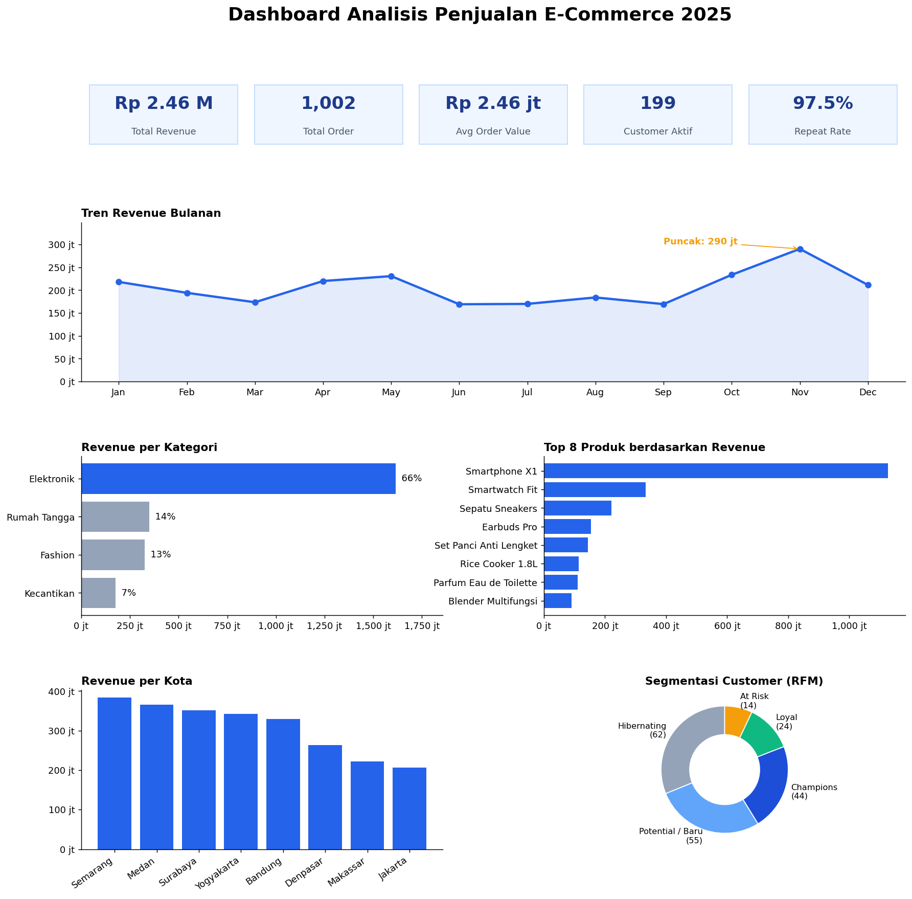
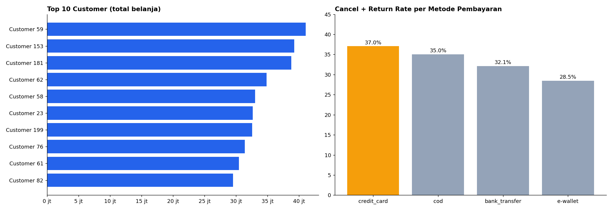

# Analisis Penjualan E-Commerce 2025 (PostgreSQL)

Project analisis data menggunakan SQL untuk menjawab pertanyaan bisnis seputar revenue, produk, pelanggan, dan metode pembayaran pada sebuah toko e-commerce fiktif di Indonesia.

> **Catatan:** dataset adalah data simulasi (dummy) yang dibuat otomatis lewat SQL, sehingga angka tidak mewakili kondisi bisnis nyata. Tujuan project ini adalah mendemonstrasikan kemampuan analisis SQL.

## Dashboard Hasil

## Pertanyaan Bisnis

1. Bagaimana performa penjualan secara keseluruhan (KPI)?
2. Bagaimana tren revenue bulanan dan pertumbuhannya?
3. Kategori dan produk apa yang paling menyumbang revenue?
4. Kota mana yang paling potensial?
5. Siapa pelanggan terbaik dan bagaimana segmentasinya (RFM)?
6. Berapa tingkat repeat purchase?
7. Metode pembayaran mana yang paling sering cancel/return?

## Dataset

Database terdiri dari 4 tabel:

| Tabel | Isi | Jumlah baris |
|---|---|---|
| `customers` | Data pelanggan (kota, tanggal daftar) | 200 |
| `products` | Produk, kategori, harga | 12 |
| `orders` | Transaksi (tanggal, status, metode bayar) | 1.500 |
| `order_items` | Detail produk per transaksi | ± 3.000 |

Definisi revenue: `quantity × unit_price`, hanya untuk order berstatus `completed`.

## Temuan Utama

- **Revenue** total Rp 2,46 miliar dari 1.002 order selesai, dengan rata-rata nilai order Rp 2,46 juta.
- **Tren bulanan:** puncak di November (Rp 290 juta), terendah di Juni dan September (± Rp 169 juta).
- **Kategori:** Elektronik menyumbang 66% revenue, sebagian besar dari Smartphone X1.
- **Kota:**
